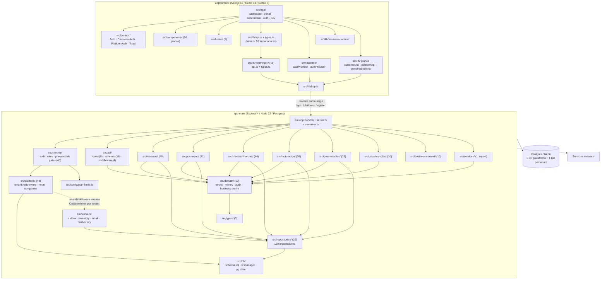

# Auditoría técnica integral — Fase 1: mapa completo + cruces entre dominios

**Fecha:** 15/09/2026. **Alcance:** solo lectura, ningún archivo de código
modificado durante esta fase. Dos agentes en paralelo, a pedido del dueño:

- **Mapa estructural completo y superficial** (`auditor-estructura`) — todas
  las carpetas/módulos de los dos repos, sin profundizar en ninguno.
- **Cruces entre dominios** (`erp-audit-orchestrator`) — flujos y
  dependencias que cruzan entre dominios de negocio distintos, a nivel de
  sistema completo, ANTES de perfilar cualquier dominio en profundidad
  (Fase 2, no autorizada todavía).

Ver `docs/auditoria-integral-fase0-2026-09-15.md` para el estado de git,
runtime y verificación de secretos (Fase 0).

**Orden explícito pedido por el dueño:** primero el mapa completo y
superficial (sin analizar ningún módulo en detalle), después los cruces
entre dominios usando ese mapa — para no perder de vista mezclas de dominio
que solo se detectan viendo el sistema completo antes de entrar en
profundidad por partes. Esta es exactamente la secuencia de este documento.

---

## Parte A — Mapa completo y superficial

### Cobertura y límites declarados (leer antes que el mapa)

Se cubrió **el 100% de las carpetas de primer y segundo nivel de `src/` en
los dos repos**, más configuración, CI, migraciones, docs y tests. Lo que
quedó con menos profundidad, a propósito y declarado:

| Área | Nivel de mapeo | Por qué |
|---|---|---|
| `app-main/src/db/schema.sql` (4230 líneas) y `platform.schema.sql` (1578) | Solo tamaño y rol; no se enumeraron tablas | Fase 1 es mapa, no modelo de datos |
| Los 259 endpoints (ahora 262, ver nota de Bloque 5 en `auditoria-integral-fase0`) | Contados vía `docs/inventario-rutas.md` (generado); no enumerados uno a uno | Ya existe el artefacto generado |
| `app-main/docs/` (158 archivos) | Inventario por nombre y categoría + fechas de último commit de 6 docs clave; no se leyó el contenido | Volumen; el dueño lo pidió así |
| `app-main/.claude/skills/` (16 skills) | Solo listado | Fuera del código productivo |
| Contenido de las 62 páginas del frontend | Solo nombre, ruta y tamaño | Mapa, no auditoría de pantalla |
| Grafo de importaciones | Conteo agregado por carpeta (grep), no exhaustivo ni transitivo | Explícitamente "superficial" |

No hay ninguna carpeta que se haya omitido en silencio.

### Mapa — Backend `/home/user/app`

**Puntos de entrada:**

| Archivo | Líneas | Rol |
|---|---|---|
| `src/server.ts` | 91 | Bootstrap: importa `./instrument.js` primero (Sentry), `createApp()`, `app.listen()`, `registerGracefulShutdown` |
| `src/app.ts` | 583 | **Composición de la app.** 15+ capas numeradas en comentarios, ~55 `app.use/get`. Monta los 38 routers |
| `src/container.ts` | 228 | DI container por tenant + pool de plataforma (`getPlatformRawPool`) |
| `src/instrument.ts` | 24 | Sentry, debe cargarse primero |
| `src/logger.ts` | 32 | pino |
| `src/platform/platform.container.ts` | — | DI separado para el plano de plataforma |

**Orden de montaje relevante** (`src/app.ts`): `/platform` (265) →
`/register` (270) → `/api/login` (271) → `/api/customer` (276) → helmet
`/api` (281) → `/api/admin`, `/api/invitations`, `/api/password-resets`
(292–308) → **gate `authenticate()` en línea 318** → `/api/companies`,
`/api/auth`, `/api/business/*` (328–341) → **`tenantMiddleware` línea 346**
→ rate limit (351) → los ~25 routers de tenant (356–388) → 7
`app.use(...)` multilínea (389–535, los *closure mounts*) → `errorHandler`
(535).

**Carpetas de `src/` — 21 en total, todas mapeadas.** Formato: contenido →
responsabilidad aparente → quién la importa (conteo grep) → ¿el nombre
coincide? → ¿mezcla responsabilidades?

1. **`src/api/`** (44 .ts) — `routes/` (8 residuales: audit-log, auth,
   business-profile, customer, locations, me, reports, system), `schemas/`
   (18 esquemas Zod de TODOS los dominios), `middleware/` (4), mappers,
   utils. 21 importadores. Nombre parcialmente vigente — tras el refactor
   de 7 fases, `api/` ya no es "la capa HTTP" (30 de 38 `*.routes.ts` viven
   en módulos de dominio). `api/schemas/` concentra esquemas de todos los
   dominios mientras sus routers viven en los módulos — asimetría, no
   confirmada como defecto.
2. **`src/business-context/`** (10 .ts) — resolver el contexto de rubro
   (capacidades/terminología por vertical), espejo del contrato con el
   frontend (§5.4/§5.5 del plan canónico). 3 importadores. Cohesionado, sin
   mezcla aparente.
3. **`src/clientes-finanzas/`** (46 .ts) — cuentas corrientes, caja,
   clientes, perfil fiscal, tarifas, `financial-transaction.repository.ts`,
   `payment-application.ts`. 31 importadores — el módulo de dominio más
   importado. Mezcla "clientes" + "finanzas" en el propio nombre, a
   confirmar si es cohesión legítima o acoplamiento (Fase 2).
4. **`src/config/`** (1 archivo) — `plan-limits.ts`. Única carpeta de
   configuración de la app, con un solo archivo.
5. **`src/db/`** (13 archivos) — schema SQL + cliente + transacciones +
   seeds + caché de health en una sola carpeta. 45 importadores.
6. **`src/domain/`** (10 .ts) — *shared kernel* (errores, dinero,
   auditoría) **+ `business-profile` completo** (entities + service), que es
   una entidad de negocio, no un primitivo. 78 importadores — la segunda
   carpeta más importada. `errors.ts` tiene 1277 líneas, catálogo único de
   errores de todos los dominios (ver Hallazgo X-01 más abajo).
7. **`src/email/`** (3 .ts) — sin mezcla aparente. 7 importadores.
8. **`src/facturacion/`** (36 .ts) — AFIP (puerto+adapter), facturas,
   notas de crédito, `padron.service.ts`, `refund-attribution.ts`. 16
   importadores. `invoice.service.ts` (1584 líneas) y
   `sql.invoice.repository.ts` (1438) son los archivos individuales más
   grandes del repo. Frente de trabajo activo de esta sesión.
9. **`src/openapi/`** (1 archivo) — `spec.ts` (1023 líneas), OpenAPI 3.0.3
   escrito a mano, cubre ~18 de 259/262 endpoints (brecha ya declarada como
   `CONTRACT-COVERAGE-001` en el `CLAUDE.md`).
10. **`src/platform/`** (48 .ts) — `platform.repository.ts` (1781 líneas,
    el archivo más grande del repo), auth de plataforma, `tenant.middleware`,
    cifrado de connection strings, provisioning Neon, 8 routers, `company`,
    `location`, `operating-hours`. 27 importadores. Mezcla el plano de
    plataforma con entidades de negocio de tenant (`companies`, `locations`,
    `operating-hours`) y aloja un worker (`company-sync.worker.ts`) mientras
    el resto vive en `src/workers/` (ver Hallazgo X-09).
11. **`src/pms-estadias/`** (23 .ts) — estadías, housekeeping, ventanas de
    mantenimiento. 11 importadores. Nombre coincide, sin mezcla evidente.
12. **`src/pos-menu/`** (41 .ts) — órdenes, productos, `service-item.*`
    (nuevo), recetas, mermas, destinos de consumo, catálogo por compañía. 9
    importadores. El módulo más parecido estructuralmente a `reservas/`.
13. **`src/repositories/`** (29 .ts) ⚠️ — **la carpeta más importada del
    repo, 130 importadores.** Cajón residual por capa (no por dominio) que
    mezcla infraestructura genuina (`domain-event`, `processed-event`,
    `number-sequence`, `audit-log`, `sql.client`) con repositorios
    claramente de dominio POS/inventario (`inventory-level`,
    `stock-movement`, `recipe-item`, `waste-reason`,
    `consumption-destination`) separados de su servicio y router en
    `pos-menu/`. **El caso más claro de mezcla de todo el repo** — ver
    Hallazgo B-06/X-09.
14. **`src/reservas/`** (69 .ts, el módulo de dominio más grande) —
    reservas, recursos, categorías, servicios reservables, políticas,
    ocupación. 15 importadores. Cinco sub-dominios en una carpeta. Dos
    archivos no siguen la convención `<entidad>.<capa>.ts`:
    `Reservation.ts` (PascalCase) y `availability.ts` (sin sufijo de capa).
15. **`src/scripts/`** (5 .ts) — entry points (migrate-tenants,
    generate-route-inventory, purge-outbox, encrypt-database-url,
    concurrency-test). 0 importadores, correcto.
16. **`src/security/`** (22 .ts) — auth, roles, gating comercial
    (`plan.middleware`, `module.middleware`), almacén de usuarios
    (`user.store.ts`). 40 importadores. Mezcla autenticación + autorización
    + gating comercial + user store en una carpeta, existiendo
    `src/usuarios-roles/` aparte.
17. **`src/services/`** (2 archivos) ⚠️ — solo `report.service.ts` + test.
    2 importadores. Residuo de la organización por capas anterior al
    refactor; su ruta HTTP vive en `src/api/routes/reports.routes.ts`.
18. **`src/types/`** (3 archivos) — `enums.ts`, `express.d.ts`,
    `visual.interface.ts`. 44 importadores. Coincide exactamente con lo
    que el `CLAUDE.md` declara — verificado.
19. **`src/usuarios-roles/`** (10 .ts) — users, roles, invitaciones,
    password reset. 1 importador. El *store* de usuarios está en
    `security/user.store.ts`, no acá.
20. **`src/workers/`** (15 .ts) — `outbox.worker.ts` (635),
    `outbox.handlers.ts` (789), `inventory.handlers.ts`, `email.handlers.ts`,
    `reservation-hold-expiry.worker.ts`. `OutboxWorker` arranca por tenant
    desde `tenantMiddleware`. 5 importadores. El worker `company-sync` vive
    en `src/platform/`, no acá — inconsistencia de ubicación.
21. **`src/tests/`** (72 archivos) — `architecture/` (10),
    `integration/` (44 + 2 helpers, Postgres real en CI), `domain/` (7,
    incluye property-based con fast-check), `security/` (5 + 2 fixtures),
    `repositories/` (2). **Totales: 215 archivos `*.test.ts`** en `src/`,
    147 co-ubicados junto al código + 68 centralizados en `src/tests/`.

**Migraciones y schema (backend):** `src/db/schema.sql` (4230 líneas,
tenant, reaplicado idempotente en cada deploy), `src/db/platform.schema.sql`
(1578, plataforma), `migrations/` (10 archivos, `003_` a `012_` — faltan
`001` y `002`, sin confirmar por qué), y `supabase/migrations/001_init.sql`
(único archivo de una carpeta `supabase/` de nivel raíz — ver Hallazgo
B-05).

**Documentación (backend) — 158 archivos, con evidencia de uso real:**
`docs/` raíz 104 `.md` (`pendientes-*.md` 23, `diseno-*.md` 31,
`continuidad-*.md` 9, `plan-*.md` 5, `roadmap-*.md` 3, `auditoria-*.md` 4,
`referencia-*.md` 4, `criterios-*.md` 2, más los documentos centrales),
`docs/conocimiento/` 9 (glosario + 6 playbooks + 2 runbooks),
**`docs/erp-auditoria-v2/` 38 archivos** — programa de auditoría previo con
19 fichas por módulo (M01–M16, T01–T05), 6 CSV de datos y 7 scripts de
extracción — **antecedente directo de esta auditoría, recomendado cruzar
antes de Fase 2**. `docs/analysis/` 7 archivos generados. Evidencia de que
se usan de verdad: `docs/rbac-matriz-endpoints.md` e
`docs/inventario-rutas.md` se actualizaron en el mismo commit que agregó
rutas nuevas — exactamente lo que las cercas de CI exigen.

### Mapa — Frontend `/home/user/appfrontend`

**Puntos de entrada y providers:** `src/app/layout.tsx` (root, 3 fuentes +
`AuthProvider`), `src/app/dashboard/layout.tsx` (486 líneas, punto de
composición real: `Refine` + `routerProvider` + `dataProvider` +
`createAuthProvider` + `ToastProvider` + `BusinessContextProvider` +
`SystemRail` + `NavList`), layouts de `portal/[businessSlug]/` y
`superadmin/`. 4 contextos en `src/context/` (Auth, CustomerAuth,
PlatformAuth, Toast) — **53 archivos importan de `context/`**, el
acoplamiento transversal más alto del frontend.

**`src/app/` — 62 archivos, 5 zonas de ruta:** `dashboard/` (35, 20 listas
+ 10 detalle `[id]` + layout/nav), `portal/[businessSlug]/` (8),
`superadmin/` (5), auth/público (7), `dev/` (4, banco de pruebas visual).
Fuera de zona: `src/app/admin/page.tsx` (234 líneas) coexiste con
`src/app/dashboard/admin/page.tsx` (111) — ver Hallazgo F-05. Pantallas más
pesadas: `dashboard/reservas/[id]/page.tsx` (730),
`dashboard/productos/page.tsx` (695), `dashboard/clientes/[id]/page.tsx`
(689). Total `src/` ≈ 24.000 líneas.

**`src/lib/`** (50 archivos) ⚠️ — 18 carpetas por dominio (`api.ts` +
`types.ts`) más `portal/` (solo `types.ts`, sin `api.ts`) y
`business-context/`. 7 archivos planos fuera del patrón:
`api.ts`/`types.ts` (barrels), `http.ts`, `apiErrors.ts`, `customerApi.ts`
(222 líneas, sin carpeta de dominio propia), `platformApi.ts`,
`pendingBooking.ts`, `auth.tsx`. Los barrels son casi puros (`api.ts` 1
línea no-reexport, `types.ts` 14). **53 archivos importan desde los
barrels `@/lib/api`/`@/lib/types` contra solo 4 que importan un
`@/lib/<dominio>/` directo** — la separación por dominio existe en el
árbol, pero el consumo real sigue pasando por el barrel casi al 100% (ver
Hallazgo F-06/X-12).

**`src/components/`** (16 archivos, planos, sin subcarpetas) — mezcla
primitivas de UI (`Modal`, `ConfirmDialog`, `SignalBadge`) con componentes
de negocio (`FacturarButton`, `RatePlanManager`, `RoomCalendar` 567
líneas). 33 importadores.

**`src/hooks/`** (2 archivos) — `useReservationsScreen.ts`,
`useAuthRole.ts`. Coincide exactamente con lo declarado en el `CLAUDE.md`.

**Tests (frontend) — 4 archivos en total:** 2 vitest
(`apiErrors.test.ts`, `numero-operativo.test.ts`) + 2 `node --test` del
escáner de deuda visual. **Cero tests de componente, página, hook o e2e.**
Contraste con 215 del backend (ver Hallazgo F-01).

**Documentación (frontend) — 8 archivos:** `docs/README.md` (índice con
tabla "Vigentes"/"Superados", el mejor ejemplo de higiene documental de los
dos repos), `sistema-diseno-zulu-hub.md` (normativo, 0 de 7 fases
ejecutadas), y `sistema-diseno-bastion.md` marcado explícitamente como
superado. Además `ARCHITECTURE.md` y `AGENTS.md` en la raíz (ver Hallazgo
F-08 — `ARCHITECTURE.md` describe organización pre-refactor).

### Diagrama Mermaid — alto nivel

### Hallazgos estructurales (mapa)

Formato: `Hallazgo / Evidencia / Impacto / Causa probable / Nivel de
certeza / Severidad / Recomendación / ¿Requiere modificar código? / Prueba
necesaria`. Ninguno propone refactor todavía — eso es Fase 2+.

**B-01 — 12 commits existen solo en esta máquina.** Ver
`auditoria-integral-fase0-2026-09-15.md`. Severidad Media (de proceso de
auditoría). No requiere código.

**B-02 — `tsconfig.json` excluye un archivo que ya no existe.**
`"exclude": ["src/reservas/supabase.occupancy.repository.ts"]`, archivo
inexistente en el árbol. Nulo en runtime, sugiere integración Supabase
abandonada. Certeza Alta, Severidad Baja. Requiere una línea de config.

**B-03 — `docs/analysis/dead-code.txt` describe una estructura de carpetas
que ya no existe.** Cita rutas pre-refactor
(`\src\domain\entities.ts`, `\src\domain\Reservation.ts`, etc., con
separadores Windows). Sin cerca de CI que detecte el drift (a diferencia
de `docs/inventario-rutas.md`). Certeza Alta, Severidad Media. Recomendación:
regenerar (`npm run deadcode`) o marcar como histórico con fecha.

**B-04 — El backend no tiene `.env.example`; el frontend sí.** Las ~20
variables de entorno del backend solo están documentadas en `render.yaml`.
Certeza Alta, Severidad Baja-Media.

**B-05 — `supabase/migrations/001_init.sql` y `.MD`: residuos en la raíz
del backend.** Un solo archivo en `supabase/` (las migraciones vivas están
en `migrations/`), y un archivo `.MD` de 1 byte versionado. Severidad Baja.

**B-06 — `src/repositories/` es un cajón por capa dentro de un repo
organizado por dominio, y es la carpeta más importada (130).** Ver detalle
arriba (punto 13) y Hallazgo X-09 (cruce con `pos-menu/`). Certeza Alta
para la observación estructural, **Baja para si debe moverse** (no se
evaluó si algunos son compartidos legítimamente entre dominios). Severidad
Media, a confirmar en Fase 2. **Recomendación: no tocar todavía.**

**B-07 — `src/services/` con un único archivo, y `src/domain/` alojando un
servicio de aplicación.** Mismo origen que B-06. Severidad Baja.

**B-08 — 2 archivos de `src/reservas/` no siguen `<entidad>.<capa>.ts`.**
`Reservation.ts` (PascalCase) y `availability.ts` (sin sufijo de capa),
contra los otros 67 archivos que sí la siguen. Certeza Alta, Severidad
Baja. Requeriría rename + imports, riesgo bajo pero toca muchos
importadores.

**B-09 — `src/db/postgres-transaction-manager.ts` existe solo para
satisfacer un import de test.** 12 líneas, docblock lo declara alias de
compatibilidad. 2 importadores vs 25/49 de las alternativas reales.
Severidad Baja — un test dictando la forma del código de producción, patrón
a vigilar.

**F-01 — El frontend tiene 4 archivos de test en total, para ~24.000
líneas y 62 rutas.** Dos de los cuatro prueban el escáner de deuda visual,
no la aplicación. Cero tests sobre `src/app/`, `src/components/`,
`src/hooks/`, `src/context/` o `src/lib/refine/dataProvider.ts` (344
líneas). El frontend auto-deploya a Vercel al pushear a `main` y su CI es
informativa por decisión explícita — no hay gate real más allá de
`tsc`/`build`/ESLint. **Severidad Alta** — la mayor asimetría de rigor
entre los dos repos.

**F-02 — `CLAUDE.md` del frontend cita `src/styles.css`, que no existe en
el árbol.** El conteo de 89 clases Tailwind crudas, con 24 atribuidas a un
archivo inexistente, está sobredimensionado en ~27%. Certeza Alta para la
inexistencia; sin confirmar el conteo real (65). Severidad Baja, pero es
el mismo modo de falla que el proyecto ya identificó dos veces.

**F-03 — `src/pages/` con solo un `.gitkeep`, en un proyecto App Router.**
Trampa latente: agregar un `.tsx` ahí crearía un router paralelo (Pages
Router) sin que nadie lo note. Severidad Baja.

**F-04 — Las tres tipografías se cargan en dos layouts, no "una sola
vez".** El `CLAUDE.md` dice que se cargan solo en `dashboard/layout.tsx`;
el root layout también las carga (a propósito, para pantallas fuera del
dashboard) — la afirmación del `CLAUDE.md` es falsa tal como está escrita.
Impacto bajo (Next probablemente deduplica), problema real es la regla
escrita.

**F-05 — Dos pantallas de administración en rutas distintas: `/admin` y
`/dashboard/admin`.** Sin confirmar si es duplicación real o pantalla
huérfana. Certeza Baja. Severidad Baja, a reevaluar en Fase 2.

**F-06 — La separación por dominio de `src/lib/` no cambió el patrón de
consumo: 53 importadores del barrel vs 4 de los dominios.** No es una
violación (el `CLAUDE.md` lo permite explícitamente) — el beneficio
conseguido es de organización de archivos, no de reducción de acoplamiento
real. Ver también Hallazgo X-12.

**F-07 — Dos clientes de API fuera del patrón por dominio: `customerApi.ts`
(222 líneas) y `platformApi.ts` (159).** Además `src/lib/portal/` existe
pero solo tiene `types.ts`, sin `api.ts`. La lista de 15 dominios del
`CLAUDE.md` no menciona `facturacion`, `maintenance-windows`,
`business-context` ni `refine`, que sí existen — la lista quedó
incompleta (ver también Hallazgo X-11).

**F-08 — `ARCHITECTURE.md` del frontend describe una organización anterior
al refactor.** Se presenta como "referencia canónica" pero contradice al
`CLAUDE.md` vigente en dónde poner tipos nuevos. Severidad Media — es un
doc que dirige decisiones de dónde escribir código.

**X-01 (Node) — Node 22 en backend / Node 24 en frontend, ninguno de los
dos con `.nvmrc`.** Cada uno internamente coherente; riesgo de entorno
local (una sola versión de Node instalada sirve a un repo y puede romper
el otro). Severidad Baja.

**X-02 (Node) — `NEON_PROJECT_ID` en claro en `render.yaml`.** No es un
hallazgo crítico — identificador de proyecto, inútil sin `NEON_API_KEY`
(protegida). Severidad Baja/informativa.

### Cosas que no se pudieron confirmar en el mapa (declaradas, no omitidas)

1. ¿`src/repositories/` debe dividirse? — No confirmado, falta el grafo de
   importadores archivo por archivo.
2. ¿`docs/analysis/duplication/*` y `dependency-*.{dot,html}` están tan
   obsoletos como `dead-code.txt`? — No confirmado.
3. ¿`/admin` del frontend está viva o huérfana? — No confirmado.
4. ¿`src/app/dev/*` queda fuera del bundle de producción? — No confirmado.
5. ¿Por qué faltan `migrations/001_` y `002_`? — No confirmado.
6. ¿Las 19 fichas de `docs/erp-auditoria-v2/` siguen vigentes? — No leídas,
   solo inventariadas. **Recomendación fuerte: cruzarlas antes de Fase 2**
   (`01-inventario-verificado.md` y `10-matriz-maestra.md` parecen el
   entregable de Fase 2 ya hecho).
7. `src/api/schemas/` con esquemas de todos los dominios — no confirmado si
   es deliberado o residuo.

---

## Parte B — Cruces entre dominios (sistema completo, dos repos)

**Método:** grafo de imports cruzados reconstruido con un script sobre los
specs relativos de cada `.ts`/`.tsx` (no grep de texto), mapa de qué
carpeta emite SQL contra qué tabla, y verificación puntual de cada hallazgo
contra el archivo vivo.

### Corrección previa al análisis: el brief no coincide con el disco

El encargo original enumeraba `housekeeping/` como dominio del backend. No
existe como carpeta propia — housekeeping vive dentro de `pms-estadias/`
(`housekeeping.service.ts`, `.repository.ts`, `.routes.ts`,
`housekeeping-task.ts`). No es un defecto de código, es un desajuste del
brief inicial.

Dominios de negocio reales en backend: `reservas/` (69 archivos),
`clientes-finanzas/` (46), `pos-menu/` (41), `facturacion/` (36),
`pms-estadias/` (23), `usuarios-roles/` (10). Capas de soporte: `api/`,
`security/`, `platform/` (48), `domain/` (10), `repositories/` (29),
`services/` (2), `workers/` (15), `business-context/`, `db/`, `types/`,
`email/`, `config/`.

### Marco: dos mecanismos de cruce en paralelo

**(a) Asíncrono, por outbox — el camino correcto y bien construido.**
`src/workers/outbox.handlers.ts:150-156` y
`src/workers/inventory.handlers.ts:144-145`: `reservation.confirmed /
completed / cancelled / price_adjusted` y `order.confirmed / completed /
cancelled` disparan efectos financieros (y de stock) en otros dominios vía
eventos. **Las escrituras cross-dominio van por acá.** Es el seam sano del
sistema.

**(b) Síncrono, por import directo del repositorio del otro dominio.**
Coexiste con (a) para los mismos pares. En los casos buenos está acotado
con `Pick<>` y es solo lectura — verificado en
`pos-menu/order.service.ts:373,387` y
`reservas/reservation.service.ts:138,147`.

**Un tercer mecanismo, el mejor de los tres, aplicado a un solo caso:**
puertos invertidos. `facturacion/cancel-order-with-credit-note.service.ts:110`
define `OrderCancelPort`; `pos-menu/order-cancel-for-credit-note.ts:52` lo
implementa. Igual para `ReservationCancelPort`. La dirección de la
dependencia es la correcta (el consumidor define el puerto) — el problema
no es el patrón, es que convive con imports directos en los mismos
archivos.

Esto importa para calibrar severidad: los números crudos de imports
cruzados (p. ej. `facturacion → clientes-finanzas` = 21) **sobreestiman**
el acoplamiento real, porque ~60% son de archivos `*.routes.ts` haciendo
composition-root local (ver Hallazgo X-08).

### Hallazgos

**X-01 — `domain/errors.ts`: catálogo compartido de 82 clases de error con
vocabulario de TODOS los dominios.** 1277 líneas, 82 `export class`.
Contiene clases de `reservas`, `facturacion`, `pos-menu`,
`clientes-finanzas`, `usuarios-roles`+`platform` en un solo archivo.
Grafo: `reservas→domain` 30, `pos-menu→domain` 27, `facturacion→domain` 27,
`clientes-finanzas→domain` 18, `pms-estadias→domain` 10,
`repositories→domain` 10. Invierte además la dirección en 4 repositorios
de `repositories/sql.*` que importan errores de negocio específicos desde
`domain/`. Certeza Alta, **Severidad Media** — violación real de bounded
context, baja urgencia. No tocar ahora; la partición natural sería
`<dominio>/<dominio>.errors.ts` + `domain/errors.ts` con solo
`DomainError`/`ValidationError`/`AuthError`/`ForbiddenError`.

**X-02 — `platform/company-sync.worker.ts` escribe con SQL crudo tablas de
`pos-menu`, reimplementando su máquina de estados.** Líneas 167-217:
`SELECT`/`INSERT`/`UPDATE`/`DELETE` directos sobre `products` y
`recipe_items` — tablas cuyo dueño declarado es
`pos-menu/sql.product.repository.ts` y
`repositories/sql.recipe-item.repository.ts`. La máquina de estados de
override vive en TypeScript en `pos-menu/company-catalog.service.ts:255-295`
Y reimplementada en SQL a mano en el worker. El worker escribe en **todas
las tenant DB** y esas escrituras no pasan por `domain/audit.ts`. Certeza
Alta (archivo leído completo), **Severidad Alta**. Violación real —
candidato #1 de Fase 2.

**X-03 — La convención de bounded context se aplicó en una sola dirección;
la inversa nunca se evaluó.** El único caso documentado
(`reservas/reservation-customer.entities.ts`) resuelve solo la dirección
`reservas → clientes-finanzas`. La dirección inversa está abierta: la
clase rica `Reservation` (38 miembros) se importa desde
`facturacion/cancel-reservation-with-credit-note.service.ts:91` (usa solo
`.id`/`.status`, 2 de 38 campos) y desde `pms-estadias/stay.service.ts:44`
(usa 6 campos **y además invoca sus métodos mutadores**). `auditoria-modularidad.md`
(Fase 7) declaró explícitamente su alcance como solo `reservas` — no es una
regresión, es un hueco nunca mirado. Certeza Alta. Severidad Media para
`facturacion` (shape leak, solo lectura); **Alta para `pms-estadias`**
(mutadores, ver X-04).

**X-04 — La máquina de estados de "cambio de horario de una reserva" está
repartida entre tres archivos de dos dominios, con la ruta HTTP en un
tercero.** Invariantes en `reservas/Reservation.ts:426-464`, orquestación
en `pms-estadias/stay.service.ts:344-428`, ruta HTTP en
`reservas/reservations.routes.ts:667-705` (que instancia `StayService` de
otro dominio para poder servirla). Documentado deliberadamente en los dos
lados. Certeza Alta, Severidad Media. Clasificación: dependencia legítima
y documentada, pero con responsabilidad repartida de forma que necesita
revisión — candidato de Fase 2, no defecto a corregir a ciegas.

**X-05 — `reservas/cancellation-refund.service.ts` ejecuta lógica de
aplicación de pagos y toma una decisión fiscal AFIP.** Importa
`CBTE_TIPO_FACTURA_B` de `facturacion/afip-catalog.constants.js`, usado en
una decisión de tipo de comprobante (`:81`); importa funciones concretas
(no interfaces) de `clientes-finanzas/payment-application.js`
(`acquireIdempotencyLock`, `applyCappedRefundToInvoice`,
`createIdempotentPaymentWithClient`, `canonicalInvoiceLockOrder`). El
docblock del archivo declara "sin ciclo real, depende de la interfaz
`InvoiceRepository`" — correcto para `facturacion`, **no describe el
import ejecutable de `payment-application.js`**. Certeza Alta (header
completo leído, usos verificados línea por línea). **Severidad Alta** — es
dinero y es fiscal. El hallazgo con más consecuencia de negocio de todo el
informe. Matiz honesto: reutilizar los helpers es mejor que
reimplementarlos; el problema es la ubicación del archivo que los
orquesta. Pregunta a resolver primero: **¿el reembolso por cancelación es
una capacidad de `reservas` o de `clientes-finanzas`?**

**X-06 — `facturacion` escribe `business_profile` (tabla de otro dominio)
sin auditoría, mientras el dueño de la tabla sí audita.** El dueño
declarado (`repositories/sql.business-profile.repository.ts` +
`domain/business-profile.service.ts`) usa `updateWithAudit()`. El segundo
escritor, `facturacion/sql.afip-credentials.repository.ts:59,69`, hace
`UPDATE business_profile SET afip_cert_encrypted = ...` / `clear()` **sin
ninguna llamada a `recordFieldChanges`/`updateWithAudit`/`auditLog`** —
verificado por grep. Certeza Alta para "no audita en ese archivo"; Media
para "no audita en ningún punto del camino" (no se siguió la ruta HTTP
completa). **Severidad Alta** (seguridad + trazabilidad fiscal) — cargar o
borrar el certificado que habilita emitir comprobantes con CAE ante AFIP
no deja rastro de quién ni cuándo. **No confirmado / información
faltante:** si la ruta que llama a `saveCredentials()`/`clear()` audita
por su cuenta antes de invocar el repositorio — verificar en
`invoices.routes.ts`. Nota aparte, legítima: el mismo archivo reusa
`encryptConnectionString`/`decryptConnectionString` de
`platform/tenant-db.setup.ts` para cifrar certificados AFIP — documentado
explícitamente como mecanismo genérico único del proyecto, severidad Baja,
solo naming.

**X-07 — `security/` (capa transversal) instancia la clase rica
`Customer` de `clientes-finanzas/`.**
`security/customer.auth.service.ts:8` — import de VALOR (no `import type`),
`new Customer(...)` en dos puntos (alta directa y alta por Google OAuth).
Dirección invertida: una capa transversal depende de un dominio de negocio
y de un constructor con invariantes, no de una interfaz. Certeza Alta,
Severidad Media. Ya listado como uno de los 3 consumidores de `Customer`
en el hallazgo D1 original de `auditoria-modularidad.md`, cuya Fase 7
declaró su alcance solo para `reservas` — **no es regresión, es el resto
no cerrado de D1.**

Otros cruces invertidos verificados como **legítimos o de severidad
Baja**: `security/auth.service.ts` → `PlatformRepository` (type-only,
legítimo); `db/tenant-context.ts` ↔ `platform/tenant.middleware.js` (ciclo
conceptual, Baja); tipos de `types/express.d.ts` (declaration merging de
Express, legítimo); `platform/tenant.middleware.ts` →
`workers/outbox.registry.js` y `platform/company-sync.worker.ts` →
`workers/adaptive-poller.js` (el segundo explícitamente aprobado por gate
previo, documentado en su propio docblock); `pos-menu/order.service.ts` →
`workers/inventory.handlers.js` (dirección invertida real, severidad
Baja-Media, mismo patrón que X-05 en chico).

**X-08 — Cada `*.routes.ts` es su propio composition root: 24 archivos
cablean repositorios de otros dominios.** Documentado como decisión en
`container.ts:7-14` (multi-tenancy: el pool se resuelve por request, no en
el container). **No es acoplamiento de dominio, es ruido que lo oculta** —
~60% de los imports cruzados del grafo vienen de acá; cualquier análisis
de dependencias futuro tiene que excluir `*.routes.ts` o el resultado es
inutilizable. Dos casos que sí exceden el patrón: `pos-menu/orders.routes.ts`
y `reservas/reservations.routes.ts` importan `buildInvoiceService` desde el
módulo de **rutas** de `facturacion` (no una API pública de servicios), y
`authorizeCreditNoteCancellation` desde un archivo de dominio en vez de
`security/` (autorización de negocio, no RBAC — tiene su propia cerca
`credit-note-escape-containment.test.ts`, clasificado como dependencia
legítima con nombre confuso). Certeza Alta. Severidad Baja como riesgo
directo, **Alta como distorsión del diagnóstico** en cualquier medición de
acoplamiento futura.

**X-09 — Cinco repositorios de `pos-menu` viven en la carpeta genérica
`repositories/`, con sus servicios en `pos-menu/`.** Ver también B-06.
`recipe-item`, `inventory-level`, `stock-movement`, `waste-reason`,
`consumption-destination` (+ `sql.`/`in-memory.`) consumidos desde 6
archivos distintos de `pos-menu/`. Certeza Alta, Severidad Baja
(organización, sin defecto funcional derivado). **Mismo patrón, otras
dos:** `platform/sql.operating-hours.repository.ts` y
`platform/location.repository.ts` son repositorios de tablas de **tenant**
(`business_hours`, `resource_hours`, `locations` — todas en `schema.sql`,
ninguna en `platform.schema.sql`), viviendo en la carpeta cuyo rol
declarado es la BD central — riesgo de wiring (invita a instanciarlos
contra `getPlatformRawPool()` en vez de `req.db`, exactamente lo que
`DEFENSIVE_DEVELOPING.md` §3 vigila).

**X-10 — Acceso SQL cruzado a tablas de otros dominios (mapa completo).**
Lecturas/JOIN cruzados normales en un ERP relacional (reportes, saldos,
conciliación) desde `clientes-finanzas` hacia `reservations`/`orders`, y
desde `pos-menu`/`reservas` hacia `customers`/`customer_rates` — no
marcados como defecto. La línea que sí importa:
`clientes-finanzas/sql.financial-transaction.repository.ts:644` — `SELECT
... FROM orders WHERE id = $1 FOR UPDATE`: `clientes-finanzas` toma un
lock sobre el agregado de `pos-menu`. Como `pos-menu` también lockea
`orders` (`sql.order.repository.ts:259`), hay superficie de deadlock
cruzando dominios. Certeza Alta para la existencia de los locks;
**hipótesis a confirmar** para el riesgo de deadlock real — requiere leer
las rutas completas y correr transacciones concurrentes contra Postgres
real (trabajo de Fase 2).

**X-11 — Backend↔Frontend: la promesa de "mismo patrón de carpetas" no se
cumple, y el `CLAUDE.md` del frontend está desactualizado.** La lista de
15 dominios declarada no incluye `facturacion` ni `maintenance-windows`
(ambos existen en disco con `api.ts`+`types.ts` reales). El mapeo contra
backend es muchos-a-muchos, no espejo (p. ej. `pos-menu` backend ↔
`productos`+`ordenes`+`catalogo` frontend) — **legítimo** (el frontend se
organiza por pantalla, el backend por agregado), lo que hay que corregir
es la afirmación del `CLAUDE.md`, no las carpetas. Además `lib/auth.tsx`
dice que el auth se maneja vía `localStorage` en páginas sueltas, y 5
`fetch()` crudos en `login`/`registro`/`page.tsx` saltean
`lib/http.ts::apiFetch` (y su interceptor de sesión vencida) — deriva real
respecto de la convención propia del repo.

**X-12 — El barrel `@/lib/api` hace que el acoplamiento por dominio del
frontend sea inmedible.** 42 de 61 archivos `.ts`/`.tsx` de `src/app/`
importan de los barrels; solo 10 importan un dominio directo. Medir
pantallas que importan ≥3 dominios da 1 sola (`dashboard/page.tsx`), lo
cual es un artefacto del barrel, no la realidad. Los cruces reales dentro
de `lib/` sí son medibles y **son pocos y sanos** (todos `import type`):
`clientes→finanzas` (2), `estadias→finanzas` (2),
`estadias→housekeeping` (1), `productos→catalogo` (1), `productos→empresa`
(1), `recursos→negocio` (1). Severidad Baja como riesgo, **Alta como
limitación de esta auditoría** — declarado explícitamente.

**X-13 — Componentes con lógica de dominio en carpeta plana compartida.**
`FacturarButton.tsx` (docblock con reglas de idempotencia de emisión de
CAE), `RoomCalendar.tsx`, `RatePlanManager.tsx` conviven con primitivas de
UI en `src/components/` sin agrupación. `FacturarButton` es el punto donde
reservas y cuentas corrientes tocan facturación en la UI — que viva en
carpeta neutra oculta que es superficie de facturación. Severidad Baja.

**X-14 — Frontend NO bypassea la capa de API (verificación negativa).**
Sin driver de BD en `package.json`, sin `DATABASE_URL` ni `from 'pg'` en
todo `src/`. **Sin hallazgo** — la separación está limpia. La asignación de
pagos calculada en el cliente (`cuentas-corrientes/page.tsx:162-178`) está
respaldada por validación real del lado del backend
(`customer-account.service.ts:232-299`) — defensa en profundidad, no
regla huérfana.

**X-15 — Re-verificación de afirmaciones de los `CLAUDE.md` (pedido
explícito del encargo):**

| Afirmación | Estado hoy |
|---|---|
| `app-main/CLAUDE.md`: "está VERDE hoy con `roles-de-fabrica/page.tsx` todavía desincronizado (8 de 9)" (ROLES-CATALOG-DRIFT-001) | **Stale.** Los 3 catálogos del frontend están en sync desde el 11/09 — el texto describe un estado anterior. |
| `app-main/CLAUDE.md`: bounded contexts con `ReservationCustomer` | Vigente en su dirección; incompleta en la inversa → X-03/X-07. |
| `auditoria-modularidad.md` D1, "7 fases, todas aplicadas" | Correcta para lo que declaró cubrir (Fase 7 = solo `reservas`); induce a leerla como "D1 cerrado del todo", lo cual es falso (`security/` sigue vivo, X-07). |
| `appfrontend-main/CLAUDE.md`: 15 dominios, "mismo patrón de carpetas" | Stale e inexacta → X-11. |
| `cancellation-refund.service.ts:1-22`: "sin ciclo real, depende de la interfaz `InvoiceRepository`" | Correcta para `facturacion`, incompleta para `clientes-finanzas` → X-05. |

### Resumen por severidad

| ID | Hallazgo | Severidad | Clasificación |
|---|---|---|---|
| X-02 | `company-sync.worker.ts` escribe SQL crudo en `products`/`recipe_items`, duplica máquina de estados | **ALTA** | Violación real |
| X-05 | `cancellation-refund.service.ts` ejecuta pagos de `clientes-finanzas` y decide comprobante AFIP | **ALTA** | Violación real |
| X-06 | `facturacion` escribe `business_profile` (certificado fiscal) sin auditoría | **ALTA** | Violación real |
| X-01 | `domain/errors.ts`: 82 clases de todos los dominios en un archivo | MEDIA | Violación real, baja urgencia |
| X-03 | Clase rica `Reservation` (38 miembros) se filtra a `facturacion`/`pms-estadias` | MEDIA | Violación real |
| X-04 | Cambio de horario repartido entre 2 dominios + ruta en un tercero | MEDIA | Documentado, necesita revisión |
| X-07 | `security/` instancia la clase rica `Customer` | MEDIA | Violación real (resto de D1) |
| X-10 | `FOR UPDATE` sobre `orders` desde `clientes-finanzas` | MEDIA | Necesita más investigación |
| X-11 | Frontend: `CLAUDE.md` stale, 2 dominios no declarados, 2 clientes sueltos, 5 `fetch()` crudos | BAJA-MEDIA | Deriva de convención propia |
| X-09 | 5 repos de `pos-menu` en `repositories/`; 2 repos de tenant en `platform/` | BAJA | Responsabilidad mal ubicada |
| X-08 | 24 `*.routes.ts` como composition roots + 2 imports desde rutas de otro dominio | BAJA (ALTA como distorsión) | Legítimo, documentado |
| X-12 | Barrel `@/lib/api` hace inmedible el acoplamiento del frontend | BAJA | Necesita más investigación |
| X-13 | Componentes de dominio en `components/` plana | BAJA | Menor |
| X-14 | Frontend no bypassea la API | — | Sin hallazgo |
| X-15 | 3+ afirmaciones de `CLAUDE.md`/docs stale o incompletas | — | Corrección documental |

**Si Fase 2 arranca por un solo lugar, el orden por consecuencia de
negocio es: X-06 (auditoría de credenciales fiscales) → X-05 (dinero y
fiscalidad fuera de su contexto) → X-02 (regla duplicada escribiendo en
todas las tenant DB).** Los tres son de dominios distintos, no se bloquean
entre sí.

### Cobertura declarada de la Parte B

**Pares de dominio revisados con evidencia:** reservas↔clientes-finanzas,
reservas↔facturacion, reservas↔pms-estadias, reservas↔platform,
pos-menu↔clientes-finanzas, pos-menu↔facturacion, pos-menu↔platform,
pos-menu↔workers, facturacion↔clientes-finanzas, facturacion↔platform,
clientes-finanzas↔pms-estadias, clientes-finanzas↔pos-menu,
pms-estadias↔reservas, usuarios-roles↔platform, security↔clientes-finanzas,
security↔platform, domain↔repositories, db↔platform,
types↔(security/repositories/db), platform↔business-context,
platform↔workers, services↔(4 dominios).

**Sin cruces encontrados (verificación negativa):** `usuarios-roles`
↔`pos-menu`, ↔`facturacion`, ↔`reservas`, ↔`clientes-finanzas`;
`pms-estadias`↔`pos-menu`, ↔`facturacion`.

**No revisado, declarado explícitamente:**
1. `src/tests/` completo — excluido a propósito del grafo de dominio (los
   tests importan de todos lados por naturaleza).
2. `services/report.service.ts` — solo se miraron sus imports (5 dominios,
   todos `import type`), clasificado provisionalmente como legítimo
   (agregador de reportes de solo lectura), sin leer su contenido.
3. `api/routes/` internamente — solo se miró `customer.routes.ts`.
4. `api/schemas/` — se notó que concentra schemas de todos los dominios,
   sin investigar si es convención deliberada o residuo.
5. Frontend `app/` a nivel de acoplamiento por dominio — imposible de
   medir por el barrel (X-12).
6. Contrato backend↔frontend campo por campo — solo se comparó
   `business-context` (el contrato canónico declarado); los otros 18
   dominios del frontend replican tipos a mano, sin verificar ninguno
   contra su backend. **El hueco más grande de este informe.**
7. Deadlock cruzado `orders`↔`financial_transactions` (X-10) — riesgo
   identificado, no confirmado.
8. `business-context/`, `email/`, `config/`, `openapi/`, `scripts/` — sin
   análisis de cruce más allá del grafo agregado.

---

## Nota para quien siga con Fase 2

Antes de empezar el inventario de módulos, leer
`app-main/docs/erp-auditoria-v2/01-inventario-verificado.md`,
`app-main/docs/erp-auditoria-v2/10-matriz-maestra.md` y los 6 CSV de
`app-main/docs/erp-auditoria-v2/datos/`. Hay 19 fichas por módulo (M01–M16,
T01–T05) con anclas, y 7 scripts de extracción reutilizables — muy
probablemente cubran buena parte de Fase 2 si siguen válidos. Lo mismo con
`app-main/docs/inventario-rutas.md` (generado, con cerca de CI) y
`app-main/docs/rbac-matriz-endpoints.md` (actualizado en el mismo commit
que el código que lo toca).

---

## Insumo del dueño para fases posteriores — propuesta de stack de
## herramientas (15/09/2026, sin aplicar, sin decidir en esta ronda)

El dueño acercó, en paralelo a esta auditoría, una propuesta de qué
herramientas usar hacia adelante. **No se implementó nada de esto en esta
ronda** — el mandato vigente para el proyecto sigue siendo "no modificar
código hasta autorización explícita más allá de Fase 0+1" (ver reglas
generales de la auditoría). Se registra acá tal cual, como insumo para
cuando se llegue a la Fase 7 (revisar arquitectura) y Fase 11 (arquitectura
objetivo recomendada) del programa de 16 fases, y para cruzarlo contra los
hallazgos de esta Parte B (en particular X-08, sobre por qué el grafo de
Dependency Cruiser necesita excluir `*.routes.ts` para no medir ruido en
vez de acoplamiento real).

> 1. **Dependency Cruiser** — ya está instalado (`lint:arch`). Mantenerlo y
>    ampliar sus reglas para impedir dependencias incorrectas entre
>    dominios.
> 2. **Zod** — ya está instalado. Usarlo como fuente única para validar
>    requests, parámetros, configuraciones y respuestas externas.
> 3. **Testcontainers con PostgreSQL** — para probar transacciones, locks,
>    constraints, migraciones, schemas y separación entre base central y
>    bases tenant usando PostgreSQL real.
> 4. **TypeScript estricto** — activar y reforzar gradualmente `strict`,
>    `noUncheckedIndexedAccess` y `exactOptionalPropertyTypes` para
>    detectar contratos débiles.
> 5. **Knip** — ya está instalado. Usarlo para localizar código, exports,
>    scripts y dependencias posiblemente abandonados, verificándolos antes
>    de eliminar algo.
> 6. **OpenAPI sincronizado con Zod** — mantener OpenAPI, pero evitar que
>    los contratos se definan duplicados. Usar Zod como fuente de verdad y
>    generar o validar la documentación a partir de esos schemas.
> 7. **CI obligatorio** — ejecutar automáticamente `npm run build`,
>    `npm run lint`, `npm run lint:arch`, `npm run test`, `npm run
>    deadcode`, y cuando corresponda `npm run test:integration`.
>
> **No incorporaría ahora:** Prisma, Drizzle, TypeORM, Kysely, ni otra
> herramienta de migraciones. El repositorio ya tiene SQL, `pg`,
> repositorios, transacciones, schemas y provisioning multi-tenant.
> Agregar un ORM ahora duplicaría responsabilidades.
>
> La combinación mínima sería: TypeScript estricto + Zod + Dependency
> Cruiser + PostgreSQL real con Testcontainers + OpenAPI sincronizado +
> Knip + CI obligatorio.

**Puntos de contacto con lo ya observado en esta auditoría, a resolver
cuando se retome este tema (no resueltos acá):**
- `TypeScript estricto` — el backend **ya** tiene `strict`,
  `noUncheckedIndexedAccess` y `exactOptionalPropertyTypes` activados
  (`tsconfig.json`, ver Fase 0/Parte A). El frontend usa `target: ES2017`
  y no se verificó si tiene las mismas flags — falta confirmarlo antes de
  tratar esto como "por hacer" en los dos repos por igual.
- `CI obligatorio` — el backend ya corre `build`/`lint`/`lint:arch`/`test`
  en CI (6 jobs, con Postgres real para integración). El frontend, en
  cambio, tiene CI **informativa por decisión explícita** (Hallazgo F-01)
  y **4 archivos de test en total** — “CI obligatorio” y
  “`npm run test`” no tienen ninguna suite real que ejecutar del lado del
  frontend hoy. Este es el desbalance más directo entre la propuesta y el
  estado medido.
- `OpenAPI sincronizado con Zod` — hoy `spec.ts` está escrito a mano y
  cubre ~18 de 259/262 endpoints (`CONTRACT-COVERAGE-001`, ya declarado
  como decisión de producto pendiente en el `CLAUDE.md`). La propuesta de
  generar/validar el spec desde los schemas Zod existentes es compatible
  con esa brecha ya medida, no la contradice.
- `Dependency Cruiser` ampliado para impedir cruces de dominio indebidos —
  directamente accionable sobre los hallazgos X-01, X-02, X-05, X-06, X-07
  de esta Parte B una vez que el dueño decida cuáles corregir.

No se tomó ninguna decisión de implementación sobre este insumo en esta
ronda — queda registrado para cuando el dueño lo retome explícitamente.
